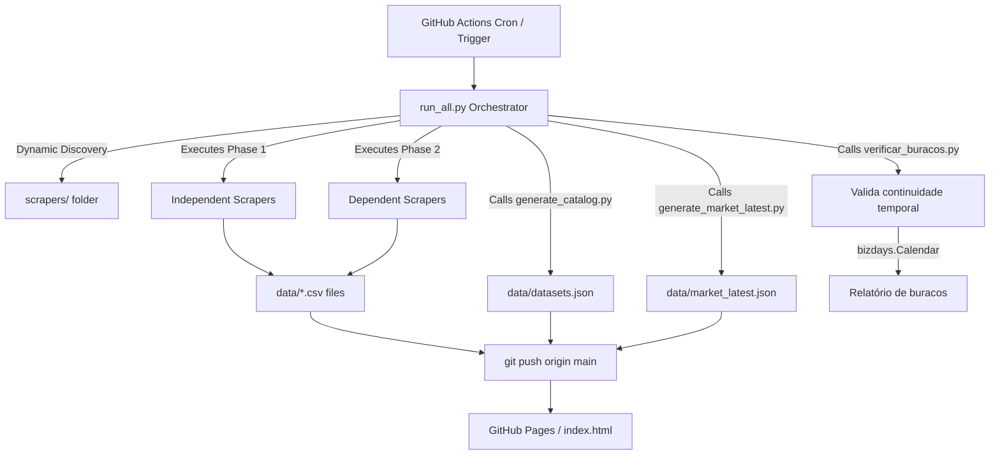

<p align="center">
  
</p>

<h1 align="center">PulseFlat</h1>

<p align="center">
  <strong>Pipeline Serverless e Automatizado de Captura de Dados Financeiros Brasileiros</strong>
</p>

<p align="center">
  <a href="https://github.com/PulseDataLabs/PulseFlat/actions/workflows/main.yml"></a>
  
  
  
  <a href="https://pulsedatalabs.github.io/PulseFlat/"></a>
  
  
</p>

<p align="center">
  <a href="#-recursos-e-diferenciais">Recursos</a> •
  <a href="#-arquitetura-do-pipeline">Arquitetura</a> •
  <a href="#-funcionamento-do-orquestrador">Funcionamento</a> •
  <a href="#-estrutura-do-projeto">Estrutura</a> •
  <a href="#-para-analistas-consuma-os-dados-sem-código">Analistas</a> •
  <a href="#-guia-do-desenvolvedor">Desenvolvedor</a> •
  <a href="#-fontes-e-datasets">Datasets</a>
</p>

---

**PulseFlat** é um pipeline de ETL (Extração, Transformação e Carga) serverless projetado para coletar, tratar e disponibilizar dados financeiros brasileiros históricos de fontes oficiais diariamente. Ele funciona 100% de forma automatizada via **GitHub Actions**, versionando o histórico diretamente no repositório em formato CSV plano, sem custos com banco de dados ou servidores.

**PulseDataLabs** nasceu da missão de democratizar o acesso a dados financeiros brasileiros de qualidade. Acreditamos que informações financeiras confiáveis não deveriam ser um privilégio de grandes instituições — por isso construímos o PulseFlat como um projeto 100% open-source.

> 💡 Quer apenas consumir os dados sem instalar nada? Acesse o **[dashboard online](https://pulsedatalabs.github.io/PulseFlat/)** ou veja o guia rápido na seção [Para Analistas](#-para-analistas-consuma-os-dados-sem-código).

---

## 🚀 Recursos e Diferenciais

*   **OOP & Abstração Sólida**: Scrapers estruturados sob uma classe base robusta (`BaseScraper`) que gerencia nativamente o ciclo de vida da execução, tratamento de exceções *thread-safe* e logs padronizados.
*   **Descoberta Dinâmica (Reflection)**: O orquestrador detecta scrapers dinamicamente inspecionando a pasta `scrapers/` no momento da execução, eliminando a necessidade de registros estáticos ou configurações hardcoded.
*   **Sanitização Automática de Dados**: Limpeza inteligente embutida que padroniza formatos de data brasileiros (`DD/MM/YYYY` ou `DD/MM/YY` para ISO `YYYY-MM-DD`) e normaliza representações decimais com vírgula para floats com ponto.
*   **Execução Concorrente Multicondicional**: Orquestrador inteligente capaz de paralelizar a execução de scripts independentes e enfileirar sequencialmente os scripts dependentes.
*   **Monitoramento de Schema Drift**: Proteção na persistência de arquivos contra mudanças repentinas nas estruturas originais de dados (emite logs detalhados sobre colunas adicionadas ou removidas).
*   **Validação de Integridade Temporal**: Verificação automática de "buracos" (dias úteis faltantes) em séries temporais, usando a biblioteca `bizdays` para garantir continuidade nas datas de referência entre a menor e a maior data de cada entidade.
*   **Frontend Otimizado (Zero CLS/LCP Baixo)**: Dashboard interativo desenvolvido em vanilla HTML/CSS que consome os JSONs estáticos diretamente do repositório, com recursos avançados de preloading, busca instantânea debouncada e renderização adiada via CSS Containment (`content-visibility`).
*   **Terminal UX colorido**: Progresso com ícones Unicode, timing por etapa e cores ANSI via módulo compartilhado `scripts/utils/ux.py` reutilizável entre scrapers e scripts de pós-processamento.

---

## 📐 Arquitetura do Pipeline

A fluxo de processamento e disponibilização de dados funciona conforme a estrutura abaixo:



---

## ⚙️ Funcionamento do Orquestrador (`run_all.py`)

O orquestrador `run_all.py` varre a pasta `scrapers/`, importa as classes e lê os metadados diretamente de seus atributos de classe:
*   `group` (grupo a que pertence: `anbima`, `bcb`, `b3`, `cvm`, `ibge`, `ratings`, `misc`).
*   `enabled` (indica se deve rodar no pipeline diário principal).
*   `phase` (ordem de dependência: Phase 1 para independentes; Phase 2 para dependentes que dependem do resultado da Phase 1).

### CLI Options e Exemplos de Uso

```bash
# Executa todos os scrapers ativos em paralelo (padrão: 4 workers)
python run_all.py

# Executa os scrapers sequencialmente (ideal para depuração de rede)
python run_all.py --sequential

# Executa em paralelo especificando um limite de threads
python run_all.py --parallel --max-workers 8

# Executa apenas scrapers pertencentes a um grupo específico
python run_all.py --group bcb
python run_all.py --group ratings

# Executa manualmente um scraper específico (mesmo se desabilitado por padrão)
python run_all.py --scraper anbima_indicadores

# Apenas regenera o catálogo data/datasets.json a partir dos metadados das classes
python run_all.py --generate-catalog

# Executa verificação de buracos ao final (dias úteis faltantes)
python run_all.py --check-holes
python run_all.py --check-holes --fail-on-holes
```

> **Scripts individuais** aceitam `--quiet`, `--verbose`, `--no-color` e `--dry-run` via `scripts.utils.ux.add_common_args()`.

### Verificando Integridade Temporal

O script `scripts/verificar_buracos.py` valida se as séries temporais nos CSVs não possuem "buracos" (dias úteis faltantes entre a menor e a maior data de referência):

```bash
# Verifica todos os CSVs de série temporal configurados
python scripts/verificar_buracos.py

# Verifica apenas CSVs específicos
python scripts/verificar_buracos.py --csv anbima_ima_completo.csv anbima_idka.csv

# Falha com exit code 1 se encontrar buracos (útil para CI)
python scripts/verificar_buracos.py --fail-on-holes

# Ignora entidades com menos de N datas (padrão: 3)
python scripts/verificar_buracos.py --threshold 5

# Lista os CSVs habilitados para verificação e suas configurações
python scripts/verificar_buracos.py --list

# Modo detalhado: mostra cada entidade com buracos e as datas faltantes
python scripts/verificar_buracos.py --verbose

# Pode ser executado ao final do pipeline via run_all.py
python run_all.py --check-holes
python run_all.py --check-holes --fail-on-holes
```

A verificação usa a `bizdays.Calendar` (feriados brasileiros 2024–2028 já definidos em `utils/parsers.py`) e faz agrupamento por entidade — cada índice, ativo ou ticker tem sua sequência de datas verificada independentemente.

CSVs de snapshot (carteiras teóricas, classificações setoriais, cadastros) não são verificados, pois seus dados representam o estado em um ponto do tempo, não uma série temporal contínua.

Ao final de uma execução completa (todos os grupos), o orquestrador executa automaticamente:
- **`scripts/generate_catalog.py`** — regenera `data/datasets.json` com os metadados atualizados
- **`scripts/generate_market_latest.py`** — extrai os últimos valores de CDI, SELIC, IPCA, IGP-M, PTAX, IBOV e IMA-GERAL para `data/market_latest.json`, alimentando o ticker em tempo real no dashboard

---

## 📂 Estrutura do Projeto

```
PulseFlat/
├── .github/
│   └── workflows/
│       └── main.yml                 # Agendamento do pipeline no GitHub Actions
├── data/                            # Datasets, schemas e metadados de controle
│   ├── datasets.json                # Catálogo estruturado de metadados dos datasets
│   ├── market_latest.json / .js     # Últimos valores de indicadores para o ticker do dashboard
│   ├── schemas.json                 # Definição e mapeamento de campos e tipos
│   ├── pipeline_status.json / .js   # Logs de saúde e duração da última execução
│   ├── last_updates.json / .js      # Período de cobertura temporal mínima/máxima de cada CSV
│   └── *.csv                        # Séries temporais de dados financeiros
├── scripts/                         # Scripts de pós-processamento
│   ├── generate_catalog.py          # Gera datasets.json a partir dos metadados
│   ├── generate_market_latest.py    # Gera market_latest.json com últimos indicadores
│   ├── populate_last_updates.py     # Atualiza last_updates.json
│   ├── limpar_duplicatas.py         # Remove duplicatas de CSVs
│   ├── verificar_buracos.py         # Valida continuidade das datas em séries temporais
│   └── utils/ux.py                  # UX compartilhada (cores, ícones, CLI args)
├── scrapers/                        # Módulos de captura
│   ├── utils/
│   │   ├── __init__.py
│   │   └── base.py                  # Classe infraestrutural BaseScraper
│   ├── generic_scraper.py           # Scraper base genérico parametrizado por YAML
│   └── *.py                         # Scripts específicos de coleta por dataset
├── utils/                           # Utilitários compartilhados auxiliares
│   ├── __init__.py
│   ├── base.py                      # Funções genéricas e salvamento de CSVs
│   ├── parsers.py                   # Parsers robustos para ZIP, Excel, XLS, CSV, FWF, XML
│   └── b3_helpers.py                # Helpers específicos para seeds da B3
├── tests/                           # Suíte de testes automatizados
│   ├── test_base_scraper.py         # Testes de sanitização e ciclo da classe base
│   ├── test_parsers.py              # Testes para os parsers auxiliares (ZIP, FWF, etc.)
│   ├── test_run_all.py              # Testes da CLI e do mecanismo de descoberta dinâmica
│   ├── test_scrapers.py             # Testes mockados de scrapers individuais
│   └── test_utils.py                # Testes de persistência de arquivos e helpers
├── run_all.py                       # Orquestrador CLI central do projeto
├── requirements.txt                 # Dependências do Python
├── .env.example                     # Template de variáveis de ambiente
├── .gitignore
└── README.md
```

---

## 📊 Para Analistas: Consuma os Dados Sem Código

Você não precisa instalar nada para usar os dados do PulseFlat. Todas as coletas são feitas automaticamente e os CSVs ficam disponíveis em URLs públicas.

### Importar no Excel ou Google Sheets

```
=IMPORTDATA("https://raw.githubusercontent.com/PulseDataLabs/PulseFlat/main/data/anbima_indicadores.csv")
```

Basta copiar a URL de qualquer dataset (lista completa no [dashboard](https://pulsedatalabs.github.io/PulseFlat/)) e usar a função `IMPORTDATA` no Google Sheets ou *Dados → De Texto/CSV* no Excel.

### Download Direto

Acesse o [dashboard interativo](https://pulsedatalabs.github.io/PulseFlat/#datasets), encontre o dataset desejado e clique em **Download CSV**. Pronto — o arquivo mais recente será baixado.

### URL Raw para Ferramentas de BI

No Power BI, Tableau ou Metabase, aponte a fonte de dados para a URL raw do GitHub:

```
https://raw.githubusercontent.com/PulseDataLabs/PulseFlat/main/data/anbima_indicadores.csv
```

Os dados são atualizados automaticamente até 7 vezes por dia útil (06h–23h, seg–sex).

---

## 💻 Guia do Desenvolvedor

### Instalação Local

1.  **Clone o repositório:**
    ```bash
    git clone https://github.com/PulseDataLabs/PulseFlat.git
    cd PulseFlat
    ```

2.  **Instale as dependências:**
    ```bash
    pip install -r requirements.txt
    ```

3.  **Configure o arquivo de variáveis de ambiente:**
    ```bash
    cp .env.example .env
    ```
    *(Edite o `.env` com suas chaves caso precise utilizar APIs oficiais da ANBIMA ou B3).*

### Criando um Novo Scraper

Basta criar um novo arquivo Python dentro de `scrapers/` herdando de `BaseScraper`. O orquestrador o detectará automaticamente:

```python
from scrapers.utils.base import BaseScraper
import pandas as pd

class MeuNovoScraper(BaseScraper):
    # Propriedades de Orquestração
    name = "meu_novo_scraper"
    group = "misc"
    enabled = True
    phase = 1
    
    # Propriedades de Persistência
    accumulate = True
    chaves_dedup = ["data_captura", "ticker"]
    
    # Propriedades do Catálogo (Metadados do Dashboard)
    title = "Meu Novo Dataset"
    description = "Coleta dados de teste diariamente."
    icon = "📊"
    icon_class = "icon-misc"
    badge = "Diário"
    badge_class = "badge-daily"
    tags = ["teste", "novo"]
    source = "Minha Fonte"

    def fetch(self) -> pd.DataFrame:
        # A lógica do scraper deve ir aqui, retornando um Pandas DataFrame
        dados = [{"ticker": "ABCD3", "preco": "10,50", "data": "04/06/2026"}]
        return pd.DataFrame(dados)
```

Para loops com progresso colorido, use as funções do módulo `scripts/utils/ux.py`:

```python
from scripts.utils.ux import print_done, print_warn

    def fetch(self) -> pd.DataFrame:
        import time
        for i, ticker in enumerate(tickers, 1):
            t0 = time.time()
            try:
                df = baixar(ticker)
                print_done(f"({i}/{len(tickers)}) {ticker}", elapsed=time.time() - t0)
            except Exception as e:
                print_warn(f"({i}/{len(tickers)}) {ticker}: {e}")
        return pd.concat(frames, ignore_index=True)
```

### Executando Testes

A suíte de testes utiliza `pytest` com `requests-mock` para testar os parsers e APIs mockadas de forma rápida e offline:

```bash
python -m pytest tests/ -v
```

---

## 📊 Fontes e Datasets

Os scrapers estão classificados nos seguintes grupos de dados principais:

| Grupo | Fonte Primária | Exemplos de Dados Disponibilizados | Frequência |
|---|---|---|---|
| **ANBIMA** | [Portal ANBIMA](https://www.anbima.com.br) / [SND Debêntures](https://www.debentures.com.br) | Taxas indicativas, Projeções de Inflação (IPCA/IGPM), Títulos Públicos, Emissões e Mercado Secundário de Debêntures, Índices IMA/IDkA. | Diária |
| **BCB** | [Banco Central do Brasil](https://www.bcb.gov.br) | Cotações diárias do Dólar (PTAX), Séries SGS (SELIC, CDI, Inflação), Negociação de títulos públicos (DEMAB), Balancetes cadastrais de bancos. | Diária |
| **CVM** | [Portal Brasileiro de Dados Abertos](https://dados.cvm.gov.br) | Cadastro geral de companhias abertas, informes diários e dados de cotas/classes de fundos. | Diária |
| **B3**     | [B3 Market Data](https://www.b3.com.br) | FIIs/ETFs listados, composição das carteiras teóricas de índices (IBOV, SMLL, ISEE, BDRX, IFNC), taxas DI Over, posição acionária / free float / capital social de companhias listadas (`b3_companhias_financeiro`). | Diária / Snapshot |
| **IBGE** | [IBGE SIDRA API](https://sidra.ibge.gov.br) | Índices oficiais de inflação do Brasil (IPCA, IPCA-15, INPC). | Mensal |
| **Misc** | [Yahoo Finance](https://finance.yahoo.com) / [ONU](https://unglobalcompact.org) | Cotações históricas de índices globais e lista de empresas brasileiras participantes do Pacto Global da ONU. | Diária |

---

## 🤝 Contribuindo

Contribuições são bem-vindas! Se você encontrou um bug, tem uma ideia para um novo scraper ou quer melhorar a documentação:

1. Abra uma [issue](https://github.com/PulseDataLabs/PulseFlat/issues) para discutir a mudança
2. Faça um fork do repositório
3. Crie um branch (`git checkout -b feature/minha-feature`)
4. Commit suas mudanças (`git commit -m 'feat: adiciona scraper X'`)
5. Push para o branch (`git push origin feature/minha-feature`)
6. Abra um Pull Request

Veja o [guia do desenvolvedor](#-guia-do-desenvolvedor) para entender a arquitetura e como criar novos scrapers.

---

## 📄 Licença

Este projeto é de código aberto e está licenciado sob os termos da licença **MIT** — você pode usar, modificar e distribuir livremente, mesmo para fins comerciais.

Dúvidas ou sugestões? Abra uma [issue](https://github.com/PulseDataLabs/PulseFlat/issues) ou entre em contato pelo GitHub da [PulseDataLabs](https://github.com/PulseDataLabs).
