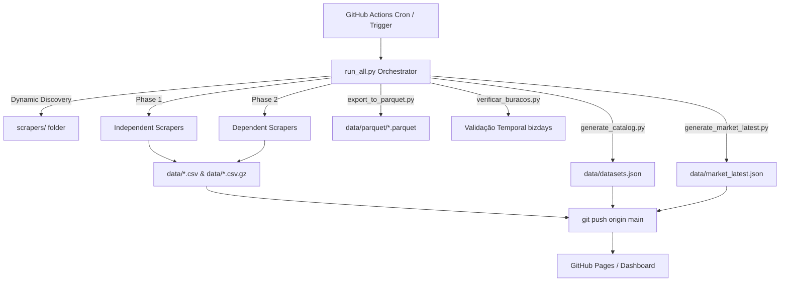

<p align="center">
  
</p>

<h1 align="center">PulseFlat</h1>

<p align="center">
  <strong>Pipeline Serverless, Resiliente e Automatizado de Dados Financeiros Brasileiros e Internacionais</strong>
</p>

<p align="center">
  <a href="https://github.com/PulseDataLabs/PulseFlat/actions/workflows/ci.yml"></a>
  <a href="https://github.com/PulseDataLabs/PulseFlat/actions/workflows/main.yml"></a>
  
  
  
  
  
  
  <a href="https://pulsedatalabs.github.io/PulseFlat/"></a>
</p>

<p align="center">
  <a href="#-recursos-e-diferenciais">Recursos</a> •
  <a href="#-arquitetura-do-pipeline">Arquitetura</a> •
  <a href="#-funcionamento-do-orquestrador">Orquestrador</a> •
  <a href="#-exportação-parquet--analytics-duckdb">Parquet & DuckDB</a> •
  <a href="#-estrutura-do-projeto">Estrutura</a> •
  <a href="#-para-analistas-consuma-os-dados-sem-código">Analistas</a> •
  <a href="#-execução-no-databricks-workflows--repos">Databricks</a> •
  <a href="#-guia-do-desenvolvedor">Desenvolvedor</a> •
  <a href="#-fontes-e-datasets">Datasets</a>
</p>

---

**PulseFlat** é um pipeline de ETL (Extração, Transformação e Carga) serverless projetado para coletar, tratar e disponibilizar dados financeiros brasileiros e internacionais de fontes oficiais diariamente. Ele funciona 100% de forma automatizada via **GitHub Actions** (9 execuções por dia útil), versionando o histórico diretamente no repositório em formatos **CSV plano**, **CSV.GZ** e **Apache Parquet**, sem custos com infraestrutura pesada ou servidores dedicados.

A **PulseDataLabs** nasceu da missão de democratizar o acesso a dados financeiros de qualidade. Acreditamos que informações financeiras confiáveis e estruturadas não deveriam ser um privilégio restrito — por isso construímos o PulseFlat como um projeto 100% *open-source*.

> 💡 Quer apenas consumir os dados sem instalar nada? Acesse o **[dashboard online](https://pulsedatalabs.github.io/PulseFlat/)**, consulte o **[explorador de indicadores](https://pulsedatalabs.github.io/PulseFlat/consulta.html)** ou veja o guia rápido na seção [Para Analistas](#-para-analistas-consuma-os-dados-sem-código).

---

## 🚀 Recursos e Diferenciais

*   **88+ Datasets Estruturados & 100+ Rotinas de Extração**: Cobertura massiva de renda fixa, renda variável, derivativos, câmbio, fundos e macroeconomia, sem paywalls nem limites artificiais.
*   **OOP & Abstração Sólida**: Scrapers estruturados sob a classe base `BaseScraper` com ciclo de vida unificado, logs padronizados, checagem defensiva de schemas e persistência incremental.
*   **Ecossistema Completo ANBIMA Data (1ª e 2ª Onda)**: Cliente HTTP OAuth 2.0 (Client Credentials) com 17 feeds oficiais via API: Curvas ETTJ (Prefixados, IPCA, Selic), Parâmetros Svensson, Letras Financeiras, CRI/CRA, FIDC, IMA/IDkA (resultados e carteiras teóricas), Selic Estimativa, VNA e REUNE Negociações.
*   **Suite Macroeconômica Global FRED (Federal Reserve)**: Integração consolidada com o Federal Reserve Bank of St. Louis em 5 grandes datasets (Curva Soberana dos US Treasuries 1M-30Y, Indicadores Macro dos EUA, Liquidez Global & Spreads de Crédito, Macro/Câmbio Brasil e Commodities Globais de Exportação).
*   **Cobertura IPEADATA**: 8 módulos temáticos contínuos cobrindo Macroeconomia, Taxas de Juros, Inflação e Preços, Formação Bruta de Capital Fixo (FBCF), Balança Comercial, Mercados Diários e Produção Mineral.
*   **Suporte a BCB Olinda, Tesouro Transparente, BrasilAPI e Eulerpool**: Clientes HTTP e classes base dedicadas para expectativas Focus (OData), títulos e leilões do Tesouro Direto (CKAN), dados abertos de instituições brasileiras (BrasilAPI) e ações/ETFs globais (Eulerpool).
*   **Descoberta Dinâmica (Reflection)**: O orquestrador detecta scrapers automaticamente inspecionando o diretório `scrapers/`, eliminando a necessidade de registros estáticos.
*   **Sanitização e Blindagem Defensiva**: Padronização estrita de datas (`YYYY-MM-DD`), conversão numérica de ponto flutuante internacional, remoção de lixo de encoding e fallbacks automáticos para integridade de esquemas.
*   **Concorrência Multicondicional**: Paralelização segura de scrapers independentes e ordenação controlada para scrapers que dependem de resultados prévios.
*   **Exportação Colunar Parquet**: Conversão rápida com `scripts/export_to_parquet.py` para integração direta de alta performance com **DuckDB**, **Polars**, **Pandas** e **Spark**.
*   **Monitoramento e Alertas de Mercado**: Sistema de alerta de debêntures e indicadores com disparos para **Telegram**, **E-mail (SMTP)** e **Webhooks (Power Automate / Teams)**.
*   **Validação de Integridade Temporal**: Verificação automática de dias úteis faltantes em séries temporais via calendário de feriados de mercado (`bizdays.Calendar`).
*   **Frontend Otimizado & Consulta Unificada**: Dashboard interativo com monitor de integridade D-N (`index.html`) e motor de consulta dinâmica com séries históricas pivotadas e gráficos Highcharts (`consulta.html`).
*   **Terminal UX Colorido**: Indicadores ANSI com ícones Unicode e tempos de execução via `scripts/utils/ux.py`.

---

## 📐 Arquitetura do Pipeline


```mermaid
graph TD
    A[GitHub Actions Cron / Trigger] --> B[run_all.py Orchestrator]
    B -->|Dynamic Discovery| C[scrapers/ folder]
    B -->|Phase 1| D[Independent Scrapers]
    B -->|Phase 2| E[Dependent Scrapers]
    D --> F[data/*.csv & data/*.csv.gz]
    E --> F
    B -->|export_to_parquet.py| P[data/parquet/*.parquet]
    B -->|generate_catalog.py| G[data/datasets.json]
    B -->|generate_market_latest.py| H[data/market_latest.json]
    B -->|verificar_buracos.py| K[Validação Temporal bizdays]
    F & G & H --> I[git push origin main]
    I --> J[GitHub Pages / Dashboard]
```

---

## ⚙️ Funcionamento do Orquestrador (`run_all.py`)

O orquestrador `run_all.py` inspeciona os scrapers em `scrapers/` e os organiza por grupos e dependências:

```bash
# Executa todos os scrapers ativos em paralelo (padrão: 4 workers)
python run_all.py

# Executa os scrapers sequencialmente (ideal para debug e traces de rede)
python run_all.py --sequential

# Executa em paralelo com número customizado de threads
python run_all.py --parallel --max-workers 8

# Executa apenas um grupo específico
python run_all.py --group bcb
python run_all.py --group anbima
python run_all.py --group b3

# Executa manualmente um scraper específico
python run_all.py --scraper anbima_indicadores

# Apenas regenera o catálogo data/datasets.json
python run_all.py --generate-catalog

# Executa verificação de integridade de séries temporais ao final
python run_all.py --check-holes
python run_all.py --check-holes --fail-on-holes
```

---

## 📦 Exportação Parquet & Analytics (DuckDB)

O formato Apache Parquet oferece compressão superior e velocidade de leitura até 10x mais rápida para análises quantitativas.

### Gerando arquivos Parquet:
```bash
# Converte todos os datasets CSV/GZ para data/parquet/*.parquet
python scripts/export_to_parquet.py

# Converte um dataset específico
python scripts/export_to_parquet.py --dataset bcb_ptax

# Define algoritmo de compressão customizado (snappy, zstd, gzip)
python scripts/export_to_parquet.py --compression zstd

# Simulação sem escrita de arquivos
python scripts/export_to_parquet.py --dry-run
```

### Consultando com DuckDB (Exemplo em Python / CLI):
```python
import duckdb

# Query SQL direta e ultrarrápida sobre o arquivo Parquet
con = duckdb.connect()
df = con.execute("""
    SELECT data_referencia, cotacao_venda 
    FROM 'data/parquet/bcb_ptax.parquet'
    WHERE data_referencia >= '2025-01-01'
    ORDER BY data_referencia DESC
""").df()
print(df.head())
```

---

## 📂 Estrutura do Projeto

```
PulseFlat/
├── .github/
│   └── workflows/
│       ├── ci.yml                   # CI de testes unitários, integração e linting (Ruff)
│       ├── main.yml                 # Pipeline agendado de automação diária
│       └── alert_debentures.yml     # Pipeline agendado de monitoramento e alertas
├── data/                            # Datasets, schemas e metadados de controle
│   ├── datasets.json                # Catálogo estruturado de metadados
│   ├── market_latest.json           # Últimos valores de indicadores para o ticker
│   ├── schemas.json                 # Definição e mapeamento de campos e tipos
│   └── *.csv / *.csv.gz             # Séries temporais de dados financeiros
├── scrapers/                        # Módulos de coleta estruturados por fonte
│   ├── utils/
│   │   ├── base.py                  # Classe BaseScraper
│   │   ├── anbima_data_client.py    # Cliente HTTP OAuth 2.0 para ANBIMA Developers
│   │   ├── anbima_data_base.py      # Classe BaseAnbimaDataScraper
│   │   ├── eulerpool_client.py      # Cliente HTTP Bearer para Eulerpool Financial Data
│   │   ├── eulerpool_base.py        # Classe BaseEulerpoolScraper
│   │   ├── brasilapi_client.py      # Cliente HTTP para dados abertos da BrasilAPI
│   │   ├── brasilapi_base.py        # Classe BaseBrasilApiScraper
│   │   ├── bcb_olinda_client.py     # Cliente HTTP OData para BCB Olinda (Focus/Crédito)
│   │   ├── bcb_olinda_base.py       # Classe BaseBcbOlindaScraper
│   │   ├── tesouro_transparente_client.py # Cliente HTTP CKAN para o Tesouro Nacional
│   │   ├── tesouro_transparente_base.py   # Classe BaseTesouroTransparenteScraper
│   │   ├── ipea_client.py           # Cliente HTTP OData v4 para IPEADATA
│   │   ├── ipea_base.py             # Classe BaseIpeaScraper
│   │   ├── fred_client.py           # Cliente HTTP para o Federal Reserve (FRED)
│   │   └── fred_base.py             # Classe BaseFredScraper
│   ├── anbima_data_template.py      # Template modelo para novos scrapers ANBIMA Data
│   ├── eulerpool_template.py        # Template modelo para novos scrapers Eulerpool
│   ├── brasilapi_template.py        # Template modelo para novos scrapers BrasilAPI
│   ├── bcb_olinda_template.py       # Template modelo para novos scrapers BCB Olinda
│   ├── tesouro_transparente_template.py # Template modelo para novos scrapers Tesouro
│   ├── ipea_template.py             # Template modelo para novos scrapers IPEADATA
│   ├── fred_template.py             # Template modelo para novos scrapers FRED
│   └── *.py                         # Scripts específicos de coleta por dataset
├── scripts/                         # Pós-processamento, catálogo e alertas
│   ├── test_anbima_connection.py    # Teste e diagnóstico de credenciais ANBIMA Data
│   ├── test_eulerpool_connection.py # Teste e diagnóstico de credenciais Eulerpool API
│   ├── test_brasilapi_connection.py # Teste e diagnóstico de conectividade BrasilAPI
│   ├── test_bcb_olinda_connection.py # Teste e diagnóstico OData do BCB Olinda
│   ├── test_tesouro_transparente_connection.py # Teste e diagnóstico CKAN do Tesouro
│   ├── test_ipea_connection.py      # Teste e diagnóstico OData v4 do IPEADATA
│   ├── test_fred_connection.py      # Teste e diagnóstico de autenticação do FRED
│   ├── export_to_parquet.py         # Conversão colunar de CSV/GZ para Parquet
│   ├── alerta_debentures.py         # Monitoramento e disparo de alertas
│   ├── sanitizar_debentures.py      # Sanitização e limpeza de debêntures
│   ├── generate_catalog.py          # Gera datasets.json a partir dos metadados
│   ├── generate_market_latest.py    # Gera market_latest.json
│   ├── verificar_buracos.py         # Valida continuidade de datas temporais
│   └── utils/ux.py                  # UX compartilhada de terminal
├── databricks/                      # Integração nativa com Databricks Workflows & Repos
│   ├── README.md                    # Guia completo de configuração e agendamento de Jobs
│   ├── run_pulseflat_job.py         # Entrypoint Python para execução via Databricks Task
│   └── notebooks/
│       ├── 01_orchestrator_notebook # Execução interativa via Databricks com widgets
│       └── 02_delta_lake_exporter   # Ingestão e upsert para tabelas Delta Lake
├── utils/                           # Utilitários de baixo nível
│   ├── base.py                      # Conexões HTTP resilientes, locks e persistência
│   ├── db.py                        # Persistência Oracle DB / SQLAlchemy
│   └── parsers.py                   # Parsers para CSV, JSON, XML, FWF e Excel
├── tests/                           # Suíte de testes automatizados
│   ├── unit/                        # Testes unitários rápidos e defensivos
│   │   ├── test_db_utils.py         # Sanitização SQL e inferência de tipos Oracle
│   │   ├── test_defensive_base.py   # Validação de concorrência, locks e timezone
│   │   ├── test_defensive_parsers.py# Robustez contra XML/JSON/CSV corrompidos
│   │   ├── test_export_to_parquet.py# Testes da CLI de conversão Parquet
│   │   └── test_ux*.py              # Testes dos componentes de terminal UX
│   └── integration/                 # Testes de integração de CLI e saída
│       ├── test_scripts_cli.py
│       └── test_scripts_output.py
├── pyproject.toml                   # Configurações de pytest, ruff e coverage
├── requirements.txt                 # Dependências do Python
├── .env.example                     # Template completo de variáveis de ambiente
└── README.md
```

---

## 📊 Para Analistas: Consuma os Dados Sem Código

Você não precisa instalar nada para usar os dados do PulseFlat. Todas as coletas são feitas automaticamente e os CSVs ficam disponíveis em URLs públicas.

### Importar no Google Sheets ou Excel

```excel
=IMPORTDATA("https://raw.githubusercontent.com/PulseDataLabs/PulseFlat/main/data/anbima_indicadores.csv")
```

Basta copiar a URL de qualquer dataset no [dashboard](https://pulsedatalabs.github.io/PulseFlat/) e usar a função `IMPORTDATA` no Google Sheets ou *Dados → Obter Dados → Da Web/Texto* no Excel.

### Download Direto
Acesse o [dashboard interativo](https://pulsedatalabs.github.io/PulseFlat/#datasets), encontre o dataset desejado e clique em **Download CSV**.

---

## ☁️ Execução no Databricks (Workflows & Repos)

O **PulseFlat** possui integração nativa com o **Databricks**, permitindo replicar as automações diárias do GitHub Actions em clusters sob demanda ou Serverless Compute, aproveitando computação distribuída e governança corporativa.

### 🌟 Benefícios no Databricks
- **Zero Retrabalho**: O código fonte (`scrapers/`, `utils/`, `run_all.py`) é reutilizado integralmente via **Databricks Git Folders (Repos)**.
- **Execução Agendada**: Substitua o cron do GitHub Actions pelo **Databricks Workflows (Jobs)** com Quartz cron nativo e alertas automáticos.
- **Segredos Transparentes**: Lê credenciais tanto de *Databricks Secrets* (`scope="pulseflat"`) quanto de *Environment Variables* configuradas no cluster.
- **Exportação Delta Lake**: Ingestão opcional e automatizada para tabelas **Delta Lake / Unity Catalog** com suporte a versionamento ACID e time-travel.

---

### 🚀 Como Configurar em 3 Passos

#### 1. Conectar o Repositório no Databricks (Git Folders)
1. No menu lateral esquerdo do Databricks, acesse **Workspace > Users > seu.email**.
2. Clique em **Add > Git Folder** (ou **Create > Git Folder**).
3. Informe a URL: `https://github.com/PulseDataLabs/PulseFlat.git` e confirme.

#### 2. Criar o Workflow Agendado (Databricks Job)
1. Acesse **Workflows** no menu lateral e clique no botão azul **Create Job**.
2. Configure a tarefa principal:
   - **Task name**: `run_scrapers`
   - **Type**: `Python script`
   - **Source**: `Workspace` (selecione `PulseFlat/databricks/run_pulseflat_job.py`)
   - **Parameters** (opcional): `["--parallel", "--max-workers", "8"]` *(você também pode filtrar por grupo: `["--group", "anbima"]`, `["--group", "fred"]` ou `["--group", "b3"]`)*
   - **Dependent Libraries**: Instale as bibliotecas de `requirements.txt` via PyPI (ex: `requests`, `beautifulsoup4`, `curl-cffi`, `pandas`, `openpyxl`, `bizdays`, `oracledb`).
3. Configure o agendamento em **Schedule** definindo os horários desejados (ex: dias úteis às 06h, 08h e 18h).

#### 3. Execução Interativa via Notebook (Depuração e Testes)
Para testar scrapers pontualmente ou fazer cargas manuais:
- Abra o notebook [`databricks/notebooks/01_orchestrator_notebook.py`](databricks/notebooks/01_orchestrator_notebook.py).
- Use os widgets visuais no topo para escolher o **Grupo de Dados**, quantidade de **Workers** e se deseja validar buracos históricos.
- Clique em **Run All**.

> [!TIP]
> Consulte o guia detalhado em [`databricks/README.md`](databricks/README.md) para detalhes adicionais de exportação Delta Lake e configuração de Secrets Scopes.

---

## 💻 Guia do Desenvolvedor

### Instalação Local

1. **Clone o repositório:**
   ```bash
   git clone https://github.com/PulseDataLabs/PulseFlat.git
   cd PulseFlat
   ```

2. **Crie o ambiente virtual e instale as dependências:**

   **Usando `uv` (Recomendado — ultra-rápido):**
   ```bash
   uv venv
   source .venv/bin/activate
   uv pip install -r requirements.txt
   ```

   **Usando `pip` padrão:**
   ```bash
   python3 -m venv .venv
   source .venv/bin/activate
   pip install -r requirements.txt
   ```

3. **Configure as variáveis de ambiente:**
   ```bash
   cp .env.example .env
   ```

---

### Executando Testes e Qualidade de Código

O projeto está configurado com `pytest` e `ruff` através do `pyproject.toml`.

```bash
# Executa apenas os testes unitários rápidos (~15 segundos)
pytest -m "not slow"

# Executa a suíte completa de testes (unitários + integração de CLI)
pytest

# Executa verificação e linting com Ruff
ruff check .

# Formatação automática de código
ruff format .
```

---

### Persistência Opcional no Oracle Database

O projeto suporta persistência automática e incremental em banco de dados **Oracle Cloud Autonomous Database** via `oracledb` + `SQLAlchemy`.

Configure as variáveis no `.env`:
* `ORACLE_DB_USER`: Usuário do banco
* `ORACLE_DB_PASSWORD`: Senha do banco
* `ORACLE_DB_DSN`: String de conexão / DSN do serviço
* `ORACLE_DB_WALLET_DIR` (opcional): Caminho da carteira mTLS descompactada
* `ORACLE_DB_WALLET_PASSWORD` (opcional): Senha da carteira

> **Dica:** Para desativar a conexão com o banco em execuções locais, use `SKIP_ORACLE_DB=1` no `.env` ou passe `--skip-db`.

---

### 🏛️ Integração com ANBIMA Developers (ANBIMA Data)

O PulseFlat possui suporte nativo e modular para consumir feeds e APIs do portal [ANBIMA Developers](https://developers.anbima.com.br/pt/).

#### 1. Configuração das Credenciais
Adicione suas credenciais no arquivo `.env` (ou em *Settings → Secrets and variables → Actions* no GitHub):
```env
ANBIMA_CLIENT_ID=seu_client_id
ANBIMA_CLIENT_SECRET=seu_client_secret
```
*(Nota: as variáveis alternativas `API_ANBIMA_CLIENT_ID` e `API_ANBIMA_CLIENT_SECRET` também são aceitas automaticamente).*

#### 2. Validando a Conexão
Para verificar o status das credenciais e a emissão do token OAuth 2.0 em tempo real, execute o utilitário de diagnóstico:
```bash
python scripts/test_anbima_connection.py
```

#### 3. Criando um Novo Scraper da ANBIMA Data
O PulseFlat disponibiliza o template documentado `scrapers/anbima_data_template.py`. Para criar uma nova coleta, basta herdar de `BaseAnbimaDataScraper`:

```python
from scrapers.utils.anbima_data_base import BaseAnbimaDataScraper
import pandas as pd

class AnbimaExemploScraper(BaseAnbimaDataScraper):
    name = "anbima_exemplo"
    title = "ANBIMA — Exemplo de Dataset"
    endpoint = "/feed/precos-indices/v1/..."
    chaves_dedup = ["data_captura", "data_referencia", "codigo"]

    def fetch(self) -> pd.DataFrame:
        registros = self.fetch_endpoint(self.endpoint)
        return pd.DataFrame(registros)

if __name__ == "__main__":
    AnbimaExemploScraper().run()
```
O `BaseAnbimaDataScraper` gerencia automaticamente a autenticação Bearer, renovação de token em background, injeção de headers (`client_id`), tratamento de rate-limiting (HTTP 429), extração de payloads envelopados e a integração com o orquestrador `run_all.py`.

---

### 🌐 Integração com Eulerpool Financial Data API

O PulseFlat possui suporte nativo e modular para consumir os 375+ endpoints do portal [Eulerpool Developers](https://eulerpool.com/developers) (`https://api.eulerpool.com`).

#### 1. Configuração da API Key
Adicione sua chave no arquivo `.env` (ou em *Settings → Secrets and variables → Actions* no GitHub):
```env
EULERPOOL_API_KEY=sua_chave_aqui
```
*(Nota: os aliases `API_EULERPOOL_KEY` e `EULERPOOL_TOKEN` também são aceitos automaticamente).*

#### 2. Validando a Conexão
Para testar se sua chave está ativa e comunicando com a API da Eulerpool, execute o diagnóstico:
```bash
python scripts/test_eulerpool_connection.py
```

#### 3. Criando um Novo Scraper da Eulerpool
O PulseFlat disponibiliza o template documentado `scrapers/eulerpool_template.py`. Para criar uma nova coleta, herde de `BaseEulerpoolScraper`:

```python
from scrapers.utils.eulerpool_base import BaseEulerpoolScraper
import pandas as pd

class EulerpoolExemploScraper(BaseEulerpoolScraper):
    name = "eulerpool_exemplo"
    title = "Eulerpool — Exemplo de Cotações"
    endpoint = "/api/1/..."
    chaves_dedup = ["data_captura", "data_referencia", "ticker"]

    def fetch(self) -> pd.DataFrame:
        registros = self.fetch_endpoint(self.endpoint)
        return pd.DataFrame(registros)

if __name__ == "__main__":
    EulerpoolExemploScraper().run()
```
O `BaseEulerpoolScraper` gerencia automaticamente a autenticação Bearer, retries automáticos com backoff para rate-limiting (HTTP 429), desempacotamento de respostas JSON e integração direta com o orquestrador `run_all.py`.

---

### 🇧🇷 Integração com BrasilAPI

O PulseFlat possui suporte nativo e modular para consumir os endpoints abertos da [BrasilAPI](https://brasilapi.com.br/docs) (`https://brasilapi.com.br/api`).

#### 1. Conectividade e Latência
A BrasilAPI é pública e aberta (não requer API key por padrão). Para validar a conectividade e medir o tempo de resposta em tempo real, execute:
```bash
python scripts/test_brasilapi_connection.py
```

#### 2. Criando um Novo Scraper da BrasilAPI
O PulseFlat disponibiliza o template documentado `scrapers/brasilapi_template.py`. Para criar uma nova coleta, herde de `BaseBrasilApiScraper`:

```python
from scrapers.utils.brasilapi_base import BaseBrasilApiScraper
import pandas as pd

class BrasilapiTaxasScraper(BaseBrasilApiScraper):
    name = "brasilapi_taxas"
    title = "BrasilAPI — Taxas de Juros Oficiais"
    endpoint = "/taxas/v1"
    chaves_dedup = ["data_captura", "codigo"]

    def fetch(self) -> pd.DataFrame:
        registros = self.fetch_endpoint(self.endpoint)
        return pd.DataFrame(registros)

if __name__ == "__main__":
    BrasilapiTaxasScraper().run()
```
O `BaseBrasilApiScraper` cuida da injeção de headers adequados, tratamento de rate-limiting (HTTP 429), extração de registros JSON e integração com o pipeline do `run_all.py`.

---

### 🏛️ Integração com BCB Olinda (OData)

O PulseFlat possui suporte especializado para a API OData do Banco Central (`https://olinda.bcb.gov.br/olinda/servico`), permitindo coletar com facilidade expectativas do Boletim Focus, taxas de juros de operações de crédito e tarifas bancárias.

#### 1. Diagnóstico de Conexão
```bash
python scripts/test_bcb_olinda_connection.py
```

#### 2. Criando um Scraper OData
Utilize o template `scrapers/bcb_olinda_template.py` e herde de `BaseBcbOlindaScraper`. A classe base injeta `$format=json`, cuida da paginação OData e desempacota o array `value` automaticamente.

---

### 🪙 Integração com Tesouro Transparente (CKAN)

Acesso à API aberta CKAN do Tesouro Nacional (`https://www.tesourotransparente.gov.br/ckan/api/3`) para preços históricos do Tesouro Direto, dados da Dívida Pública Federal (DPF) e leilões soberanos.

#### 1. Diagnóstico de Conexão
```bash
python scripts/test_tesouro_transparente_connection.py
```

#### 2. Criando um Scraper do Tesouro
Utilize o template `scrapers/tesouro_transparente_template.py` e herde de `BaseTesouroTransparenteScraper`.

---

### 🦅 Integração com FRED (Federal Reserve Economic Data)

Acesso a mais de 800.000 séries macroeconômicas globais do Federal Reserve Bank of St. Louis (`https://api.stlouisfed.org/fred`), incluindo US 10Y/2Y Treasuries, Fed Funds e DXY.

#### 1. Configuração da API Key
Gere sua chave gratuita em [fred.stlouisfed.org](https://fred.stlouisfed.org/docs/api/api_key.html) e adicione ao `.env` (ou GitHub Secrets):
```env
FRED_API_KEY=sua_chave_fred_aqui
```

#### 2. Diagnóstico de Conexão
```bash
python scripts/test_fred_connection.py
```

#### 3. Criando um Scraper do FRED
Utilize o template `scrapers/fred_template.py` e herde de `BaseFredScraper`, definindo apenas `series_id` (ex: `'DGS10'` para o juro do título de 10 anos americano).

### 🏛️ Integração com IPEADATA (OData v4)

Acesso à API OData v4 aberta do Instituto de Pesquisa Econômica Aplicada (`http://www.ipeadata.gov.br/api/odata4/`), disponibilizando milhares de séries históricas macroeconômicas brasileiras e internacionais sem necessidade de chaves de API.

#### 1. Diagnóstico de Conexão
```bash
python scripts/test_ipea_connection.py
```

#### 2. Criando um Scraper do IPEADATA
Utilize o template `scrapers/ipea_template.py` e herde de `BaseIpeaScraper`. Basta definir o dicionário `SERIES` com os códigos oficiais e nomes de colunas:

```python
from scrapers.utils.ipea_base import BaseIpeaScraper

class IpeaMeuDatasetScraper(BaseIpeaScraper):
    name = "ipea_meu_dataset"
    title = "IPEA — Meu Dataset Macroeconômico"
    description = "Séries históricas extraídas do IPEADATA OData v4."

    SERIES = {
        "BM12_TJOVER12": "taxa_over_ano",
        "BM12_TJTLP12": "taxa_tlp_ano",
    }

    def fetch(self):
        return self.fetch_series_list(self.SERIES)
```

---

## 📊 Fontes e Datasets

O repositório mantém **88+ datasets estruturados** e versionados, totalizando mais de 100 rotinas de coleta automáticas diárias. Todos os dados são padronizados em UTF-8 com separador vírgula e datas no padrão ISO 8601 (`YYYY-MM-DD`).

### Visão Geral por Grupo de Origem

| Grupo | Fonte Primária | Datasets Ativos | Exemplos de Dados Disponibilizados | Frequência |
|---|---|:---:|---|---|
| **ANBIMA & Crédito** | [ANBIMA Developers](https://developers.anbima.com.br) / [Portal ANBIMA](https://www.anbima.com.br) / [Debêntures](https://www.debentures.com.br) | **30** | Curvas ETTJ, Parâmetros Svensson, Letras Financeiras, CRI/CRA, FIDC, Índices IMA/IDkA, Selic Estimativa, VNA, REUNE e Debêntures. | Diária / D+1 |
| **B3** | [B3 Market Data](https://www.b3.com.br) | **26** | Posições em Aberto de Opções (Open Interest & Put/Call Ratio), Carteiras Teóricas (IBOV, SMLL, etc.), Negócios BDI, Resumo de Derivativos, Taxas Swap/Juros, FIIs/ETFs, ISIN, COTAHIST e Limites de Garantias. | Diária / D-0 |
| **FRED** | [Federal Reserve Bank of St. Louis](https://fred.stlouisfed.org) | **5** | Curva Soberana dos US Treasuries (1M-30Y), Macro EUA (CPI, PCE, Emprego), Liquidez Global & Spreads, Ciclos Brasil e Commodities. | Diária / Mensal |
| **IPEADATA** | [IPEA](http://www.ipeadata.gov.br) | **8** | Macroeconomia, Taxas de Juros, Inflação e Preços, Formação Bruta de Capital Fixo (FBCF), Balança Comercial e Produção Mineral. | Diária / Mensal |
| **Banco Central (BCB)** | [Banco Central do Brasil](https://www.bcb.gov.br) | **7** | Cadastro de Instituições (IF.data / SFN), Câmbio PTAX, Séries Temporais SGS (Selic, CDI, IGP-M), DEMAB Títulos Públicos, Balancetes Cosif e Capital Basileia. | Diária / Trimestral |
| **CVM** | [Dados Abertos CVM](https://dados.cvm.gov.br) | **3** | Informes Diários de Fundos, Registro de Classes/Subclasses RCVM 175 e Cadastro Geral de Companhias Abertas. | Diária / D+1 |
| **IBGE** | [IBGE SIDRA](https://sidra.ibge.gov.br) | **1** | Índices oficiais de inflação (IPCA, IPCA-15, INPC) e agregados macroeconômicos. | Mensal |
| **Mercado Global & Outros** | [Yahoo Finance](https://finance.yahoo.com) / [Wikipedia](https://www.wikipedia.org) / [ONU](https://unglobalcompact.org) | **12** | Ações BR e Globais, FIIs, Criptoativos, Commodities, Câmbio Global, Títulos Soberanos Internacionais e Pacto Global ONU. | Diária / Tempo Real |

---

### 🏛️ ANBIMA Data & Mercado de Crédito Privado (30 Datasets)

Integração oficial via API OAuth 2.0 (`developers.anbima.com.br`), web scraping do portal clássico e do Portal Debêntures:

* **Curvas de Juros ETTJ** (`anbima_curvas_juros_ettj.csv.gz`): Estrutura a termo da taxa de juros zero-cupom dos Títulos Públicos Federais (Prefixados, IPCA e Selic).
* **Parâmetros Svensson** (`anbima_curvas_juros_parametros_svensson.csv.gz`): Parâmetros do modelo paramétrico de Svensson (Beta 1 a 4, Tau 1 e 2) calibrados diariamente.
* **Curvas de Crédito Corporativo** (`anbima_curvas_credito.csv.gz`): Spreads e taxas de crédito privado por classificação de risco / rating.
* **Letras Financeiras** (`anbima_letras_financeiras.csv.gz`): Matrizes de vértices, taxas indicativas e spreads de Letras Financeiras por emissor.
* **CRI e CRA Mercado Secundário** (`anbima_cri_cra_mercado_secundario.csv.gz`): Preços, taxas indicativas e negociações de Certificados de Recebíveis Imobiliários e do Agronegócio.
* **FIDC Mercado Secundário** (`anbima_fidc_mercado_secundario.csv.gz`): Preços e taxas indicativas de Fundos de Investimento em Direitos Creditórios.
* **Títulos Públicos — Mercado Secundário** (`anbima_titulos_publicos_mercado_secundario.csv.gz`): Preços de negociação, taxas de compra/venda e PU de mercado de LTN, LFT, NTN-B e NTN-F.
* **Títulos Públicos Federais** (`anbima_titulos_publicos.csv`): Taxas indicativas, desvios e preços unitários do portal clássico.
* **Títulos Públicos — VNA Oficial** (`anbima_titulos_publicos_vna.csv.gz`): Valor Nominal Atualizado oficial de cada título público federal.
* **Estimativa Oficial da Taxa Selic** (`anbima_titulos_publicos_estimativa_selic.csv.gz`): Projeção de curto prazo da taxa Selic calculada pela ANBIMA.
* **Família de Índices IMA** (`anbima_indices_ima_resultados.csv.gz`): Resultados diários dos subíndices de renda fixa pública (IMA-B, IMA-B 5, IMA-B 5+, IMA-C, IMA-S, IRF-M, IRF-M 1, IRF-M 1+).
* **Carteira Teórica do IMA** (`anbima_indices_carteira_teorica_ima.csv.gz`): Composição analítica e pesos dos títulos componentes de cada subíndice IMA.
* **Resultados do Índice IDkA** (`anbima_indices_idka_resultados.csv.gz`): Índices de Duração Constante ANBIMA (Pré e IPCA com durações de 2 a 30 anos).
* **Índices IDkA** (`anbima_idka.csv`): Série histórica clássica dos índices de duração constante.
* **Índice IDA** (`anbima_indice_ida.csv.gz`): Índice de Debêntures ANBIMA (Geral, DI e IPCA).
* **Carteira Teórica do IDA** (`anbima_indices_carteira_teorica_ida.csv.gz`): Ativos componentes e peso no índice de debêntures.
* **Índice IMA-B Histórico** (`anbima_indice_imab.csv.gz`): Série diária do IMA-B com número índice e variação percentual.
* **REUNE Negociações** (`anbima_reune_negociacoes.csv.gz`): Tape diário de operações de crédito privado reportadas ao sistema REUNE.
* **Debêntures — Emissões e Características (API ANBIMA)** (`debentures_emissoes_caracteristicas_api.csv`): Metadados completos, remuneração, garantias e escrituras via API.
* **Debêntures — Mercado Secundário (API ANBIMA)** (`debentures_mercado_secundario_precos_negociacao_api.csv.gz`): Preços, taxas médias e volumes negociados via API.
* **Debêntures — Emissões e Características (Web)** (`debentures_emissoes_caracteristicas.csv`): Base cadastral de debêntures do portal clássico.
* **Debêntures — Mercado Secundário (Web)** (`debentures_mercado_secundario_precos_negociacao.csv.gz`): Negociações secundárias diárias do portal clássico.
* **Indicadores Financeiros ANBIMA** (`anbima_indicadores.csv`): Taxa DI, SELIC, poupança, TR e TBF.
* **Projeções Econômicas** (`anbima_projecoes.csv`): Projeções de mercado para inflação, taxa de juros e câmbio.
* **Projeções Oficiais de Inflação** (`anbima_projecoes_inflacao.csv.gz`): Projeções detalhadas da inflação (IPCA e IGP-M) via API.
* **Matriz de Probabilidade de Resgate** (`anbima_matriz_probabilidade_resgate.csv`): Matrizes de liquidez e resgate de fundos de investimento.
* **Resolução 550** (`anbima_550.csv`): Base cadastral de fundos regulados sob a instrução 550.
* **Ranking Global de Fundos** (`anbima_ranking_global.csv`): Patrimônio líquido e captação líquida por gestor/administrador.

---

### 🌐 FRED — Federal Reserve Economic Data (5 Datasets Consolidados)

Séries macroeconômicas globais do Banco Central dos Estados Unidos (St. Louis Fed):

* **Curva de Juros dos US Treasuries** (`fred_us_treasuries_yield_curve.csv.gz`): Estrutura a termo soberana americana completa: 1M, 3M, 6M, 1Y, 2Y, 3Y, 5Y, 7Y, 10Y, 20Y e 30Y (`DGS1MO` a `DGS30`), incluindo a inclinação 10Y-2Y Spread (`T10Y2Y`) e a expectativa de inflação implícita 10-Year Breakeven (`T10YIE`).
* **Indicadores Macroeconômicos dos EUA** (`fred_us_macro_indicators.csv.gz`): Inflação CPI Headline e Core (`CPIAUCSL`, `CPILFESL`), PCE Headline e Core (`PCEPI`, `PCEPILFE`), Taxa de Desemprego (`UNRATE`), Emprego Não-Agrícola Nonfarm Payrolls (`PAYEMS`), PIB Real (`GDPC1`), Vendas no Varejo (`RSAFS`) e Produção Industrial (`INDPRO`).
* **Liquidez Global e Spreads de Crédito** (`fred_global_liquidity_credit_spreads.csv.gz`): Fed Funds Effective Rate (`FEDFUNDS`), Balanço Total de Ativos do Fed (`WALCL`), Taxa SOFR (`SOFR`), Spread TED (`TEDRATE`), Spread de Crédito High Yield Corporativo ICE BofA OAS (`BAMLH0A0HYM2`), Volatilidade VIX CBOE (`VIXCLS`) e Taxas de Commercial Paper (`RIFSPPNA270NB`).
* **Brasil: Macro, Câmbio Fed/BIS e Ciclos OCDE** (`fred_brazil_macro_fx_and_cycles.csv.gz`): Taxa de Câmbio Fed Dólar/Real (`DEXBZUS`), Câmbio Real Efetivo Broad BIS Brasil (`RBBRBIS`), Indicador Antecipador Composto de Ciclos Econômicos OCDE CLI (`BRALORSGPNOSTSAM`), Selic vs Fed Funds, M2 Money Supply Brasil (`MABMM301BRM189S`) e Spread de Risco Emergente OAS ICE BofA (`BAMLEMHBHYCRPIOAS`).
* **Commodities Globais da Pauta Exportadora do Brasil** (`fred_brazil_export_commodities.csv.gz`): Preço global da Soja FMI (`PSOYBUSDM`), Petróleo Bruto Brent (`DCOILBRENTEU`), Petróleo WTI (`DCOILWTICO`), Minério de Ferro Global 62% Fe CFR China FMI (`PIORECRUSDM`), Café Arábica (`PCOFFOTMUSDM`) e Açúcar Global FMI (`PSUGAISAUSDM`).

---

### 🏛️ IPEADATA (8 Datasets)

* **Macroeconomia e Contas Nacionais** (`ipea_macroeconomia.csv`): Agregados do PIB, consumo das famílias, consumo do governo e poupança nacional.
* **Taxas de Juros e Rendimentos** (`ipea_taxas_juros.csv`): Taxas Selic over, Selic meta, TJLP, TLP e taxas referenciais do mercado.
* **Preços e Inflação** (`ipea_precos_inflacao.csv`): Séries históricas de IPCA, IGP-DI, IGP-M, INPC e IPC-Fipe.
* **Formação Bruta de Capital Fixo (FBCF)** (`ipea_fbcf.csv`): Indicadores mensais de investimentos e absorção de bens de capital.
* **Comércio Exterior** (`ipea_comercio_exterior.csv`): Exportações, importações, saldo comercial e termos de troca.
* **Mercados Financeiros Diários** (`ipea_mercados_diarios.csv`): Indicadores diários de mercado de capitais e crédito.
* **Produção Mineral e Siderurgia** (`ipea_producao_mineral.csv`): Produção de minério de ferro, aço bruto e laminados.
* **Calendário e Dias Úteis** (`ipea_calendario.csv`): Número de dias úteis e dias corridos por mês segundo feriados nacionais.

---

### ◉ B3 — Brasil, Bolsa, Balcão (30 Datasets)

* **Mercado a Termo e Posições em Aberto**: Posições em Aberto no Mercado a Termo (`b3_termo_posicoes_aberto.csv`) detalhando contratos, ativos, volume financeiro em R$ e preço médio por ativo/empresa (ações, units e BDRs); e Resumo Histórico Consolidado de Termo (`b3_termo_posicoes_resumo.csv`) agregando volume total de contratos, ativos e capital negociado a termo no pregão.
* **Valor de Mercado das Empresas Listadas**: Capitalização de Mercado Mensal das Empresas Listadas (`b3_valor_mercado_empresas.csv`) cobrindo ~350 companhias com valor em R$, valor em US$, variação percentual mensal e flags de pertencimento ao IBOV e IBrX-100; e Totais Consolidados de Mercado (`b3_valor_mercado_totais.csv`) com total geral da bolsa, IBOVESPA e IBrX-100 em moeda local e estrangeira.
* **Opções e Posições em Aberto**: Snapshot Completo de Opções em Aberto (`b3_opcoes_posicoes_aberto.csv.gz`) cobrindo ~50.000 séries diárias de ações e índices com detalhamento de posições cobertas, descobertas, em travas e número de titulares/lançadores; e Resumo Histórico por Ativo e Put/Call Ratio (`b3_opcoes_posicoes_resumo.csv`) agregando Open Interest de CALLs e PUTs, Put/Call Ratio e strikes de maior liquidez.
* **Carteiras Teóricas de Índices**: IBOVESPA (`b3_carteira_teorica_ibov.csv`), Small Caps SMLL (`b3_carteira_teorica_smll.csv`), Sustentabilidade ISEE (`b3_carteira_teorica_isee.csv`), BDRX (`b3_carteira_teorica_bdrx.csv`), Financeiro IFNC (`b3_carteira_teorica_ifnc.csv`), Dividendos IBSD (`b3_carteira_teorica_ibsd.csv`), IBX 50 (`b3_carteira_teorica_ibxl.csv`), Agronegócio AGFS/IAGRO (`b3_carteira_teorica_agfs_iagro.csv`) e Composição Completa Consolidada de todos os índices B3 (`b3_carteiras_teoricas.csv`).
* **Cotações e Histórico**: COTAHIST Diário (`b3_cotahist_diario.csv.gz`), COTAHIST Anual Histórico (`b3_cotahist_anual.csv.gz`) e Negócios de Ações BDI Trades (`b3_bdi_trades_acoes.csv.gz`).
* **Derivativos e Renda Fixa**: Derivativos — Resumo das Operações BDI (`b3_bdi_derivativos_resumo.csv`), Taxas de Swap e Juros BMF (`b3_bmf_taxas_juros.csv`), DI Over BDI (`b3_bdi_di_over.csv`), ETFs de Renda Fixa BDI (`b3_bdi_etfrf.csv.gz`), Indicadores Econômicos FWF (`b3_indicadores_economicos_fwf.csv`) e Indicadores Financeiros (`b3_indicadores_financeiros.csv`).
* **Cadastros e Regulação**: Títulos e Valores Negociáveis (`b3_titulos_negociaveis.csv.gz`), Cadastro de Códigos ISIN de Ativos (`b3_isin_ativos.csv.gz`), Classificação Setorial (`b3_classificacao_setorial.csv`), Limites de Garantias (`b3_limites_garantias.csv`), Fundos Listados (`b3_fundos_listados.csv`), FIIs (`b3_fiis.csv`) e ETFs Listados (`b3_etfs.csv`).

---

### ◆ Banco Central do Brasil (7 Datasets) & ⬢ CVM (3 Datasets)

* **BCB Cadastro de Instituições** (`bacen_cadastro_instituicoes.csv`): Cadastro completo de todas as instituições financeiras e entidades autorizadas pelo BACEN (IF.data / SFN) com classificação prudencial (S1-S5), tipo de controle, consolidação, atividade e situação cadastral.
* **BCB PTAX** (`bcb_ptax.csv`): Cotações diárias oficiais de compra e venda de moedas estrangeiras.
* **BCB SGS** (`bcb_sgs.csv`): Séries temporais essenciais (Selic a.d. e a.a., CDI, IGP-M, IPCA acumulado).
* **BCB DEMAB Títulos Públicos** (`bacen_negociacao_tpf_extragrupo.csv.gz`): Operações definitivas de compra/venda de títulos federais no mercado secundário.
* **BCB Balancetes Cosif** (`bacen_balancetes_bancos.csv`): Balancetes patrimoniais contábeis das instituições financeiras autorizadas.
* **BCB Conglomerados** (`bacen_conglomerados.csv`): Estrutura de conglomerados financeiros e prudenciais.
* **BCB Basileia** (`bacen_parcelas_capital_basileia.csv.gz`): Requerimentos de capital e patrimônio de referência.
* **CVM Informe Diário** (`cvm_fundos_informe_diario.csv.gz`): Cota diária, patrimônio líquido e número de cotistas de todos os fundos de investimento abertos no Brasil.
* **CVM RCVM 175** (`registro_fundo_classe.csv.gz`): Cadastro unificado de classes e subclasses de fundos de investimento sob a nova regulação 175.
* **CVM Companhias Abertas** (`cvm_cadastro_companhias_abertas.csv`): Cadastro oficial de emissores de ações e debêntures.

---

## 🤝 Contribuindo

Contribuições são muito bem-vindas!
1. Abra uma [issue](https://github.com/PulseDataLabs/PulseFlat/issues) para relatar problemas ou sugerir novos scrapers.
2. Faça um fork do repositório e crie uma branch (`git checkout -b feature/minha-feature`).
3. Garanta que os testes e linter passem (`pytest -m "not slow"` e `ruff check .`).
4. Envie seu Pull Request!

---

## 📄 Licença

Este projeto é de código aberto e está licenciado sob os termos da licença **MIT** — sinta-se livre para usar, modificar e distribuir.
