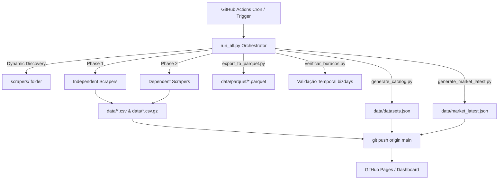

<p align="center">
  
</p>

<h1 align="center">PulseFlat</h1>

<p align="center">
  <strong>Pipeline Serverless, Resiliente e Automatizado de Dados Financeiros Brasileiros</strong>
</p>

<p align="center">
  <a href="https://github.com/PulseDataLabs/PulseFlat/actions/workflows/ci.yml"></a>
  <a href="https://github.com/PulseDataLabs/PulseFlat/actions/workflows/main.yml"></a>
  
  
  
  
  <a href="https://pulsedatalabs.github.io/PulseFlat/"></a>
  
</p>

<p align="center">
  <a href="#-recursos-e-diferenciais">Recursos</a> •
  <a href="#-arquitetura-do-pipeline">Arquitetura</a> •
  <a href="#-funcionamento-do-orquestrador">Orquestrador</a> •
  <a href="#-exportação-parquet--analytics-duckdb">Parquet & DuckDB</a> •
  <a href="#-estrutura-do-projeto">Estrutura</a> •
  <a href="#-para-analistas-consuma-os-dados-sem-código">Analistas</a> •
  <a href="#-guia-do-desenvolvedor">Desenvolvedor</a> •
  <a href="#-fontes-e-datasets">Datasets</a>
</p>

---

**PulseFlat** é um pipeline de ETL (Extração, Transformação e Carga) serverless projetado para coletar, tratar e disponibilizar dados financeiros brasileiros históricos de fontes oficiais diariamente. Ele funciona 100% de forma automatizada via **GitHub Actions**, versionando o histórico diretamente no repositório em formatos **CSV plano**, **CSV.GZ** e **Apache Parquet**, sem custos com infraestrutura pesada ou servidores dedicados.

A **PulseDataLabs** nasceu da missão de democratizar o acesso a dados financeiros brasileiros de qualidade. Acreditamos que informações financeiras confiáveis e estruturadas não deveriam ser um privilégio restrito — por isso construímos o PulseFlat como um projeto 100% *open-source*.

> 💡 Quer apenas consumir os dados sem instalar nada? Acesse o **[dashboard online](https://pulsedatalabs.github.io/PulseFlat/)** ou veja o guia rápido na seção [Para Analistas](#-para-analistas-consuma-os-dados-sem-código).

---

## 🚀 Recursos e Diferenciais

*   **OOP & Abstração Sólida**: Scrapers estruturados sob a classe base `BaseScraper` com ciclo de vida unificado, logs padronizados e persistência inteligente.
*   **Descoberta Dinâmica (Reflection)**: O orquestrador detecta scrapers automaticamente inspecionando o diretório `scrapers/`, eliminando a necessidade de registros estáticos.
*   **Sanitização e Blindagem Defensiva**: Padronização de datas (`DD/MM/YYYY` ou `DD/MM/YY` para ISO `YYYY-MM-DD`), conversão de números decimais com vírgula para ponto e fallbacks automáticos para dados corrompidos.
*   **Concorrência Multicondicional**: Paralelização segura de scrapers independentes e ordenação controlada para scrapers que dependem de resultados prévios.
*   **Exportação Colunar Parquet**: Conversão rápida com `scripts/export_to_parquet.py` para integração direta de alta performance com **DuckDB**, **Polars**, **Pandas** e **Spark**.
*   **Monitoramento e Alertas de Mercado**: Sistema de alerta de debêntures e indicadores com disparos para **Telegram**, **E-mail (SMTP)** e **Webhooks (Power Automate / Teams)**.
*   **Validação de Integridade Temporal**: Verificação automática de dias úteis faltantes em séries temporais via `bizdays.Calendar`.
*   **Frontend Otimizado**: Dashboard interativo em vanilla HTML/CSS com busca instantânea debouncada e consulta rápida.
*   **Terminal UX Colorido**: Indicadores ANSI com ícones Unicode e tempos de execução via `scripts/utils/ux.py`.

---

## 📐 Arquitetura do Pipeline


```mermaid
graph TD
    A[GitHub Actions Cron / Trigger] --> B[run_all.py Orchestrator]
    B -->|Dynamic Discovery| C[scrapers/ folder]
    B -->|Phase 1| D[Independent Scrapers]
    B -->|Phase 2| E[Dependent Scrapers]
    D --> F[data/*.csv & data/*.csv.gz]
    E --> F
    B -->|export_to_parquet.py| P[data/parquet/*.parquet]
    B -->|generate_catalog.py| G[data/datasets.json]
    B -->|generate_market_latest.py| H[data/market_latest.json]
    B -->|verificar_buracos.py| K[Validação Temporal bizdays]
    F & G & H --> I[git push origin main]
    I --> J[GitHub Pages / Dashboard]
```

---

## ⚙️ Funcionamento do Orquestrador (`run_all.py`)

O orquestrador `run_all.py` inspeciona os scrapers em `scrapers/` e os organiza por grupos e dependências:

```bash
# Executa todos os scrapers ativos em paralelo (padrão: 4 workers)
python run_all.py

# Executa os scrapers sequencialmente (ideal para debug e traces de rede)
python run_all.py --sequential

# Executa em paralelo com número customizado de threads
python run_all.py --parallel --max-workers 8

# Executa apenas um grupo específico
python run_all.py --group bcb
python run_all.py --group anbima
python run_all.py --group b3

# Executa manualmente um scraper específico
python run_all.py --scraper anbima_indicadores

# Apenas regenera o catálogo data/datasets.json
python run_all.py --generate-catalog

# Executa verificação de integridade de séries temporais ao final
python run_all.py --check-holes
python run_all.py --check-holes --fail-on-holes
```

---

## 📦 Exportação Parquet & Analytics (DuckDB)

O formato Apache Parquet oferece compressão superior e velocidade de leitura até 10x mais rápida para análises quantitativas.

### Gerando arquivos Parquet:
```bash
# Converte todos os datasets CSV/GZ para data/parquet/*.parquet
python scripts/export_to_parquet.py

# Converte um dataset específico
python scripts/export_to_parquet.py --dataset bcb_ptax

# Define algoritmo de compressão customizado (snappy, zstd, gzip)
python scripts/export_to_parquet.py --compression zstd

# Simulação sem escrita de arquivos
python scripts/export_to_parquet.py --dry-run
```

### Consultando com DuckDB (Exemplo em Python / CLI):
```python
import duckdb

# Query SQL direta e ultrarrápida sobre o arquivo Parquet
con = duckdb.connect()
df = con.execute("""
    SELECT data_referencia, cotacao_venda 
    FROM 'data/parquet/bcb_ptax.parquet'
    WHERE data_referencia >= '2025-01-01'
    ORDER BY data_referencia DESC
""").df()
print(df.head())
```

---

## 📂 Estrutura do Projeto

```
PulseFlat/
├── .github/
│   └── workflows/
│       ├── ci.yml                   # CI de testes unitários, integração e linting (Ruff)
│       ├── main.yml                 # Pipeline agendado de automação diária
│       └── alert_debentures.yml     # Pipeline agendado de monitoramento e alertas
├── data/                            # Datasets, schemas e metadados de controle
│   ├── datasets.json                # Catálogo estruturado de metadados
│   ├── market_latest.json           # Últimos valores de indicadores para o ticker
│   ├── schemas.json                 # Definição e mapeamento de campos e tipos
│   └── *.csv / *.csv.gz             # Séries temporais de dados financeiros
├── scrapers/                        # Módulos de coleta estruturados por fonte
│   ├── utils/base.py                # Classe BaseScraper
│   └── *.py                         # Scripts específicos de coleta por dataset
├── scripts/                         # Pós-processamento, catálogo e alertas
│   ├── export_to_parquet.py         # Conversão colunar de CSV/GZ para Parquet
│   ├── alerta_debentures.py         # Monitoramento e disparo de alertas
│   ├── sanitizar_debentures.py      # Sanitização e limpeza de debêntures
│   ├── generate_catalog.py          # Gera datasets.json a partir dos metadados
│   ├── generate_market_latest.py    # Gera market_latest.json
│   ├── verificar_buracos.py         # Valida continuidade de datas temporais
│   └── utils/ux.py                  # UX compartilhada de terminal
├── utils/                           # Utilitários de baixo nível
│   ├── base.py                      # Conexões HTTP resilientes, locks e persistência
│   ├── db.py                        # Persistência Oracle DB / SQLAlchemy
│   └── parsers.py                   # Parsers para CSV, JSON, XML, FWF e Excel
├── tests/                           # Suíte de testes automatizados
│   ├── unit/                        # Testes unitários rápidos e defensivos
│   │   ├── test_db_utils.py         # Sanitização SQL e inferência de tipos Oracle
│   │   ├── test_defensive_base.py   # Validação de concorrência, locks e timezone
│   │   ├── test_defensive_parsers.py# Robustez contra XML/JSON/CSV corrompidos
│   │   ├── test_export_to_parquet.py# Testes da CLI de conversão Parquet
│   │   └── test_ux*.py              # Testes dos componentes de terminal UX
│   └── integration/                 # Testes de integração de CLI e saída
│       ├── test_scripts_cli.py
│       └── test_scripts_output.py
├── pyproject.toml                   # Configurações de pytest, ruff e coverage
├── requirements.txt                 # Dependências do Python
├── .env.example                     # Template completo de variáveis de ambiente
└── README.md
```

---

## 📊 Para Analistas: Consuma os Dados Sem Código

Você não precisa instalar nada para usar os dados do PulseFlat. Todas as coletas são feitas automaticamente e os CSVs ficam disponíveis em URLs públicas.

### Importar no Google Sheets ou Excel

```excel
=IMPORTDATA("https://raw.githubusercontent.com/PulseDataLabs/PulseFlat/main/data/anbima_indicadores.csv")
```

Basta copiar a URL de qualquer dataset no [dashboard](https://pulsedatalabs.github.io/PulseFlat/) e usar a função `IMPORTDATA` no Google Sheets ou *Dados → Obter Dados → Da Web/Texto* no Excel.

### Download Direto
Acesse o [dashboard interativo](https://pulsedatalabs.github.io/PulseFlat/#datasets), encontre o dataset desejado e clique em **Download CSV**.

---

## 💻 Guia do Desenvolvedor

### Instalação Local

1. **Clone o repositório:**
   ```bash
   git clone https://github.com/PulseDataLabs/PulseFlat.git
   cd PulseFlat
   ```

2. **Crie o ambiente virtual e instale as dependências:**

   **Usando `uv` (Recomendado — ultra-rápido):**
   ```bash
   uv venv
   source .venv/bin/activate
   uv pip install -r requirements.txt
   ```

   **Usando `pip` padrão:**
   ```bash
   python3 -m venv .venv
   source .venv/bin/activate
   pip install -r requirements.txt
   ```

3. **Configure as variáveis de ambiente:**
   ```bash
   cp .env.example .env
   ```

---

### Executando Testes e Qualidade de Código

O projeto está configurado com `pytest` e `ruff` através do `pyproject.toml`.

```bash
# Executa apenas os testes unitários rápidos (~15 segundos)
pytest -m "not slow"

# Executa a suíte completa de testes (unitários + integração de CLI)
pytest

# Executa verificação e linting com Ruff
ruff check .

# Formatação automática de código
ruff format .
```

---

### Persistência Opcional no Oracle Database

O projeto suporta persistência automática e incremental em banco de dados **Oracle Cloud Autonomous Database** via `oracledb` + `SQLAlchemy`.

Configure as variáveis no `.env`:
* `ORACLE_DB_USER`: Usuário do banco
* `ORACLE_DB_PASSWORD`: Senha do banco
* `ORACLE_DB_DSN`: String de conexão / DSN do serviço
* `ORACLE_DB_WALLET_DIR` (opcional): Caminho da carteira mTLS descompactada
* `ORACLE_DB_WALLET_PASSWORD` (opcional): Senha da carteira

> **Dica:** Para desativar a conexão com o banco em execuções locais, use `SKIP_ORACLE_DB=1` no `.env` ou passe `--skip-db`.

---

## 📊 Fontes e Datasets

| Grupo | Fonte Primária | Exemplos de Dados Disponibilizados | Frequência |
|---|---|---|---|
| **ANBIMA** | [Portal ANBIMA](https://www.anbima.com.br) / [SND Debêntures](https://www.debentures.com.br) | Taxas indicativas, Projeções de Inflação (IPCA/IGPM), Títulos Públicos, Emissões e Mercado Secundário de Debêntures, Índices IMA/IDkA. | Diária |
| **BCB** | [Banco Central do Brasil](https://www.bcb.gov.br) | Cotações diárias do Dólar (PTAX), Séries SGS (SELIC, CDI, Inflação), Negociação de títulos públicos (DEMAB), Balancetes cadastrais de bancos. | Diária |
| **CVM** | [Portal Brasileiro de Dados Abertos](https://dados.cvm.gov.br) | Cadastro geral de companhias abertas, informes diários e dados de cotas/classes de fundos. | Diária |
| **B3** | [B3 Market Data](https://www.b3.com.br) | FIIs/ETFs listados, composição de carteiras teóricas (IBOV, SMLL, ISEE, BDRX, IFNC), taxas DI Over, dados cadastrais e financeiros de companhias, limites de garantias. | Diária / Snapshot |
| **IBGE** | [IBGE SIDRA API](https://sidra.ibge.gov.br) | Índices oficiais de inflação (IPCA, IPCA-15, INPC). | Mensal |
| **Misc** | [Yahoo Finance](https://finance.yahoo.com) / [Wikipedia](https://www.wikipedia.org) / [ONU](https://unglobalcompact.org) | Ações brasileiras e globais, ETFs, moedas, criptoativos, commodities e Pacto Global da ONU. | Diária |

---

## 🤝 Contribuindo

Contribuições são muito bem-vindas!
1. Abra uma [issue](https://github.com/PulseDataLabs/PulseFlat/issues) para relatar problemas ou sugerir novos scrapers.
2. Faça um fork do repositório e crie uma branch (`git checkout -b feature/minha-feature`).
3. Garanta que os testes e linter passem (`pytest -m "not slow"` e `ruff check .`).
4. Envie seu Pull Request!

---

## 📄 Licença

Este projeto é de código aberto e está licenciado sob os termos da licença **MIT** — sinta-se livre para usar, modificar e distribuir.
